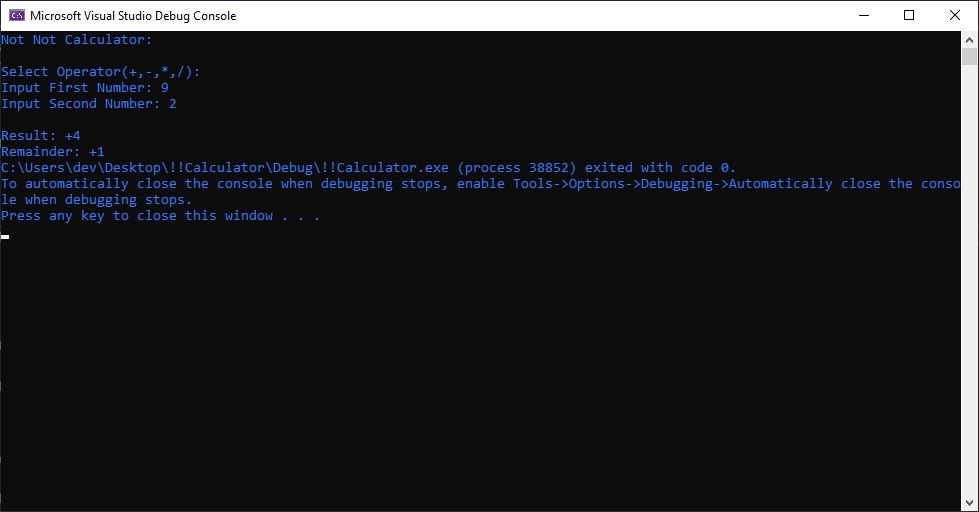
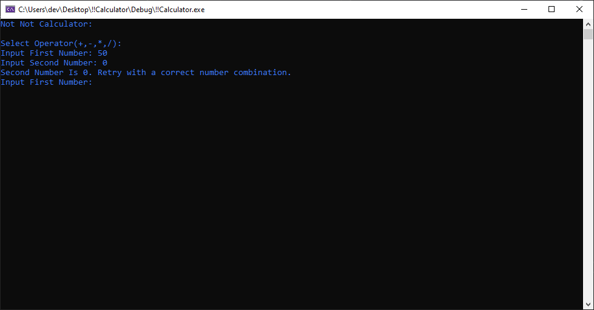
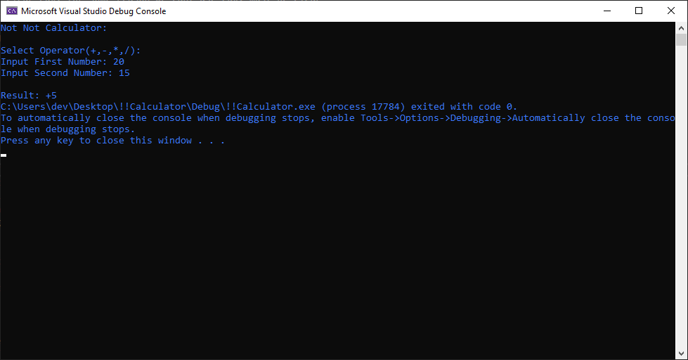
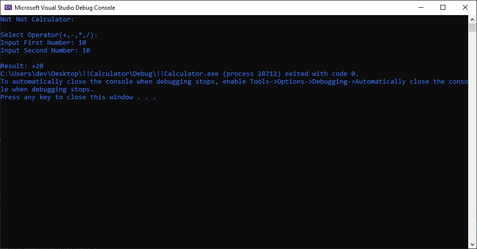
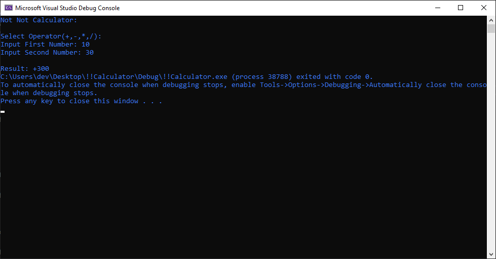

# NotNotCalculator
Assembly calculator using Irvine x86 library. Utilizes addition, multiplication, division and subtraction with adequate error handling.
 
I found my Irvine x86 book lying around and decided to take a break from the more complex higher-level programs I have been working on.   A retreat to simplicity. 

## Images:
Division:

  

  

  

Subtraction:

  

  

Addition:

  

Multiplication:

  

